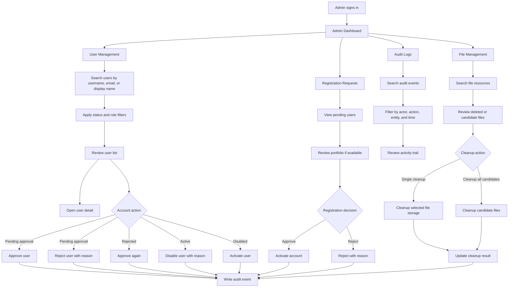

# Leader Follow-up Fixes - Admin Audit, Search, Auth Token

Date: 2026-07-06
Branch: feature/phase7-file-cleanup-integrated

## Scope

This revision documents leader follow-up fixes for Admin Audit, Admin User Management search, and Auth token handling.

Covered items:

1. Normalize audit EntityId GUID handling.
2. Fix Admin User Management search Enter behavior.
3. Remove hard-coded 14-day token expiration from auth flow.
4. Move JWT generation logic out of AuthController.
5. Add Admin business flowchart.

Out of scope:

- No database schema change for AuditEvent.EntityId.
- No migration was added.
- No database records are deleted.
- No unrelated Admin UI or business flow changes are included.

## 1. Audit EntityId normalization

Audit user filtering no longer queries both D and N GUID string formats.
Audit write paths now store GUID entity IDs using canonical D format.

AuditEvent.EntityId remains string because changing it to Guid is a database schema and API contract change.
That should be handled as a separate migration task after checking existing audit data.

Suggested DB check before a future Guid migration:

```sql
SELECT TOP 50 entity_type, entity_id
FROM audit.AuditEvent
WHERE entity_id IS NOT NULL
  AND TRY_CONVERT(uniqueidentifier, entity_id) IS NULL;
```

## 2. Admin User Management search Enter

The Admin User Management search field now handles Enter key presses.
The Enter handler reuses ApplyFiltersAsync, so it stays aligned with the existing Search button behavior.

Changed file:

- MangaManagementSystem.Web/Components/Pages/Admin/UserAccounts.razor

## 3. Auth token expiration and JWT generation

AuthController no longer owns JWT generation logic.

JWT generation was moved to:

- MangaManagementSystem.API/Services/IJwtTokenService.cs
- MangaManagementSystem.API/Services/JwtTokenService.cs

Token lifetime is now read from Jwt:ExpireMinutes instead of DateTime.UtcNow.AddDays(14).
The Web login flow uses ExpiresAtUtc from the API login response.
AuthenticationSessionOptions was added for the legacy CustomAuthenticationStateProvider fallback path.

## 4. Admin business flowchart



## Validation

- Build succeeded after AuditEvent normalization.
- Build succeeded after Admin Search Enter fix.
- Build succeeded after Auth token refactor.
- No AddDays(14) remains in auth/token files.
- GenerateJwtToken no longer exists in AuthController.
- git diff --check did not report whitespace errors.

Existing compiler and analyzer warnings are outside this follow-up scope.
